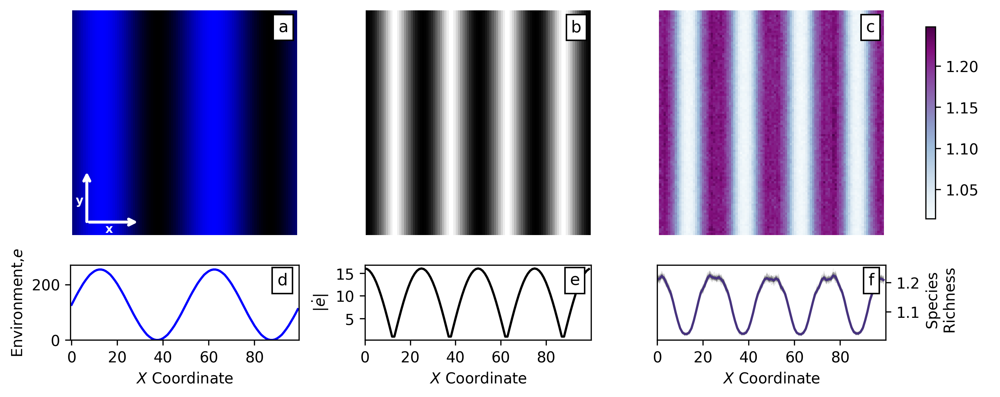

# Directory Overview 
In this directory you can find the main scripts used to replicate the results. Half of the files are to replicate REvoSim results, while the other half is for the examplar equatorial transect. 

### Files related to the REvoSim example  

| File | Description |
|------|-------------|
| `environment.py` | Generates the environment file for REvoSim |
| `REvoSim_settings_15dp_image.xml` | Settings file for REvoSim, using the same parameters as the paper (`d=15`) |
| `fetch-data.py` | Extracts needed information from REvoSim output logs (for example this could be used to reduce the size of the logs after running the simulations on an HPC and extract only the data needed for the rest of the analysis) |
| `sx-maps.py` | Creates figures from `fetch-data.py` output |
| `figure-4_high_res.png` | Output figure from `sx-maps.py` |

### Files related to the real-world example: Birds Transect  

| File | Description |
|------|-------------|
| `correlation.py` | Computes correlation between environmental variables and species richness transect |
| `derivative.py` | python script to calculate derivative and applying the gaussiang smoothing  |
| `grids-housekeeping.gmt` | Converts `.tif` files to the correct format and reprojects them |
| `transect-africa.gmt` | Executes `correlation.py` and `derivative.py` and generates the figure |
| `paper-figure_0_200km.png` | Output figure from `transect-africa.gmt` |

---

# :microbe: REvoSim to study the relationship between species richness and environment

The first part of this guide provides instructions on:

- Generating the environment file.
- Running a simulation in REvoSim with a dispersion parameter of 15.
- Reproducing results analogous to Figure 4a-f.

## 1. Generating the environment file
To generate the environment file, run the `environment.py` script. This will produce a `.png` file that will be used as the environment in REvoSim.

## 2. Running a Simulation
REvoSim can be run via the command line or the graphical user interface (GUI). Instructions for installing and running REvoSim are available [here](https://revosim.readthedocs.io/en/latest/).

Once REvoSim is installed, follow these steps:

1. Open REvoSim.

2. Input the environment .png file generated in Step 1:
   - Navigate to Settings > Environmental Settings > Change Environment File and upload the .png.
3. Load the simulation settings with the dispersion parameter set to 15:
   - Go to Commands > Load Settings and select the `REvoSim_settings_15dp_image.xml` file.
4. Enable CSV logging (v2.0.0):
   - Go to Logging, click on the v2.0.0 CSV Logs button, and check the Write to File box.
5. Start the simulation:
   - Click the Run For button and enter 100,000 in the dialog box.
   - To run multiple simulations in sequence, use the Batch button.

For detailed instructions on running REvoSim from the command line, refer to the [REvoSim manual](https://revosim.readthedocs.io/en/latest/). The work presented in the manuscript was done by runnign the 3000 simulations on HPC, using command line. 

## 3. Extracting Species Richness
1. Extract data from the 3000 logs and calculate species richness at each XY coordinate by running the `fetch-data.py script`. (The logs have been produced by running simulations in batches, see section 2)
   - The `fetch-data.py` script will generate `w50_15dp_grids_species_richness.csv` which can be used to plot figures and calculate $\overline{S_x}$. 
2. Generate Figure 4 using the 'sx-maps.py' script:
   - This will create Figure 4 using data from `w50_15dp_grids_species_richness.csv` and one of the REvoSim individual logs produced in Step 2.

---

# :bird: Exemplar equatorial transect

The rest of this repository contains scripts for extracting an equatorial transect of Africa to analyze species richness, precipitation, temperature, and temperature range. It also includes script for generating the figure `paper-figure_0_200km.png`.

## Requirements  
To run this analysis, you need to have **GMT 6.5** installed.  

## 1. Fetching the Data  

- **Expert range grids** (10x10 km resolution) were downloaded from [biodiversitymapping.org](https://biodiversitymapping.org/index.php/download/).  
  - The bird richness grid used: `Richness_10km_Birds_v7_EckertIV_no_seabirds.tif`  

- **Environmental data** (30 arcsec resolution) was extracted from CHELSA v2.0:  
  - **Annual Mean Temperature**: `CHELSA_bio1_1981-2010_V.2.1.tif`  
  - **Annual Temperature Range**: `CHELSA_bio7_1981-2010_V.2.1.tif`  
  - **Precipitation**: `CHELSA_bio12_1981-2010_V.2.1.tif`  

- **Topography data** was sourced from [NOAA](https://www.ngdc.noaa.gov/mgg/global/relief/ETOPO1/data/ice_surface/grid_registered/netcdf/).  
  - The grid used: `ETOPO1_Ice_g_gmt4.grd`  

## 2. Setup  
1. Download all the required grids and place them in the same directory as the GMT and Python files.  
2. Before running `transect-africa.gmt`, execute the housekeeping script (`grids-housekeeping.gmt`) to:  
   - Convert `.tif` files to the correct format  
   - Ensure all projections match

## 3. Running the scripts
From the terminal, run  `transect-africa.gmt` this should run the python scripts and produce the  `paper-figure_0_200km.png` figure.

