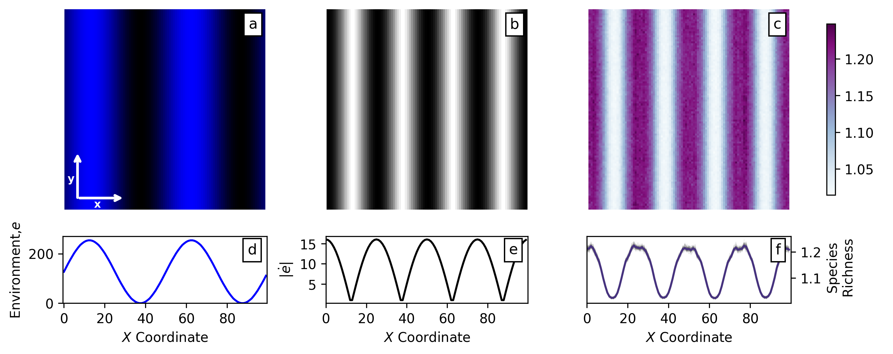

# :microbe: REvoSim to study the relationship between species richness and environment

This guide provides instructions on:

- Generating the environment file.
- Running a simulation in REvoSim with a dispersion parameter of 15.
- Reproducing results analogous to Figure 4a-f.

## 1. Generating the environment file
To generate the environment file, run the **`environment.py`** script. This will produce a **`.png`** file that will be used as the environment in REvoSim.

## 2. Running a Simulation
REvoSim can be run via the command line or the graphical user interface (GUI). Instructions for installing and running REvoSim are available [here](https://revosim.readthedocs.io/en/latest/).

Once REvoSim is installed, follow these steps:

1. Open REvoSim.

2. Input the environment .png file generated in Step 1:
   - Navigate to Settings > Environmental Settings > Change Environment File and upload the .png.
3. Load the simulation settings with the dispersion parameter set to 15:
   - Go to Commands > Load Settings and select the REvoSim_settings_15dp_image.xml file.
4. Enable CSV logging (v2.0.0):
   - Go to Logging, click on the v2.0.0 CSV Logs button, and check the Write to File box.
5. Start the simulation:
   - Click the Run For button and enter 100,000 in the dialog box.
   - To run multiple simulations in sequence, use the Batch button.

For detailed instructions on running REvoSim from the command line, refer to the [REvoSim manual](https://revosim.readthedocs.io/en/latest/).

## 3. Extracting Species Richness
1. Extract data from the 3000 logs and calculate species richness at each XY coordinate by running the fetch-data.py script. (The logs have been produced by running simulations in batches, see section 2)
   - The fetch-data.py script will generate w50_15dp_grids_species_richness.csv which can be used to plot figures and calculate $\overline{S_x}$. 
2. Generate Figure 4 using the sx-maps.py script:
   - This will create Figure 4 using data from w50_15dp_grids_species_richness.csv and one of the REvoSim individual logs produced in Step 2.

